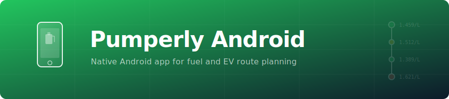

<p align="center">
  
</p>

<h1 align="center">Pumperly for Android</h1>

<p align="center">
  <strong>Open-source fuel & EV route planner — native Android app.</strong>
</p>

<p align="center">
  <a href="https://play.google.com/store/apps/details?id=com.pumperly.app"></a>
  <a href="LICENSE"></a>
  <a href="https://github.com/GeiserX/Pumperly-android/releases"></a>
</p>

---

## What is this?

The official Android app for [Pumperly](https://pumperly.com), wrapping the web app in a native shell. This keeps the web version as the single source of truth — all features, updates, and fixes land in the [main Pumperly repo](https://github.com/GeiserX/Pumperly) and are instantly available in the app without a new release.

## Features

- **Full Pumperly experience** — route planning, real-time fuel prices, EV charging, corridor filtering
- **Native geolocation** — uses Android's location services for accurate positioning
- **Deep links** — `pumperly.com` URLs open directly in the app
- **Offline fallback** — shows a friendly offline page with retry when there's no connection
- **Dark mode** — follows your system theme automatically
- **Pull-to-refresh** — swipe down to reload
- **Lightweight** — ~3 MB APK, minimal battery usage

## Install

**Google Play** (recommended):

[](https://play.google.com/store/apps/details?id=com.pumperly.app)

**Direct APK**:

Download the latest APK from [Releases](https://github.com/GeiserX/Pumperly-android/releases).

## Building from Source

```bash
git clone https://github.com/GeiserX/Pumperly-android.git
cd Pumperly-android
./gradlew assembleDebug
```

The debug APK will be at `app/build/outputs/apk/debug/app-debug.apk`.

### Signed Release Build

Pass signing config as Gradle properties (`-P`) or environment variables:

```bash
./gradlew assembleRelease \
  -PPUMPERLY_KEYSTORE_PATH=path/to/keystore.jks \
  -PPUMPERLY_KEYSTORE_PASSWORD=changeme \
  -PPUMPERLY_KEY_ALIAS=upload \
  -PPUMPERLY_KEY_PASSWORD=changeme

# Optionally override version (CI derives these from the git tag):
#   -PVERSION_NAME=1.2.0 -PVERSION_CODE=10200
```

Alternatively, set them as environment variables (`PUMPERLY_KEYSTORE_PATH`, etc.).

## Architecture

This app follows a **WebView shell** pattern:

- The web app at `pumperly.com` is the single source of truth for all UI and business logic
- The Android shell provides native bridges for geolocation, deep links, and connectivity
- New features are added to the web app and automatically appear in the Android app
- App updates are only needed for native-layer changes (permissions, deep links, Play Store metadata)

## Related Projects

| Project | Description |
|---------|-------------|
| [Pumperly](https://github.com/GeiserX/Pumperly) | Main web app — fuel & EV route planner |
| [pumperly-mcp](https://github.com/GeiserX/pumperly-mcp) | MCP Server for AI assistants |
| [pumperly-ha](https://github.com/GeiserX/pumperly-ha) | Home Assistant integration |
| [n8n-nodes-pumperly](https://github.com/GeiserX/n8n-nodes-pumperly) | n8n community node |

## License

[GPL-3.0](LICENSE)

---

<p align="center">
  Made by <a href="https://github.com/GeiserX">Sergio Fernandez</a>
</p>
